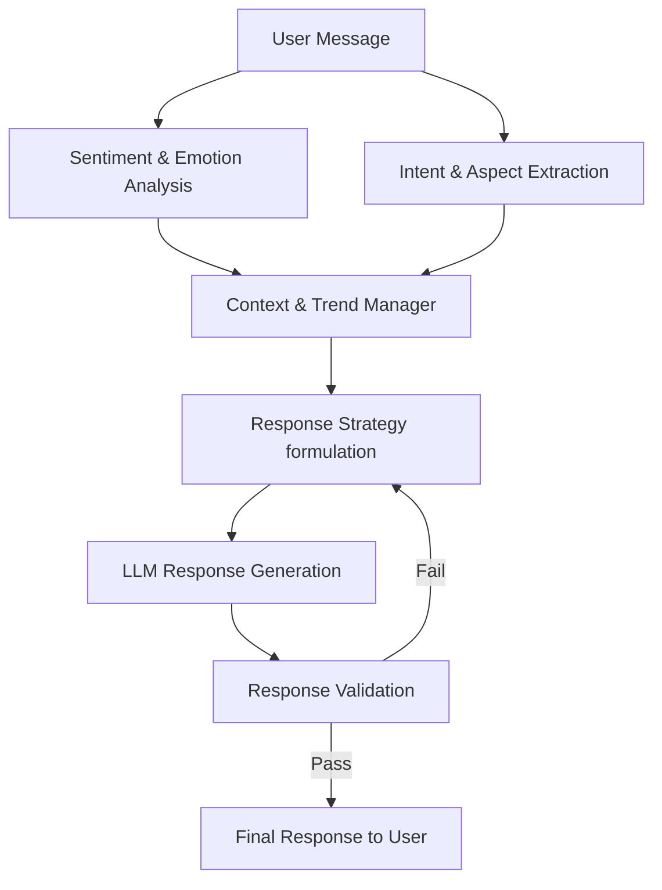

# Sentiment-Aware AI Customer Support Chatbot

## Overview
A complete Sentiment-Aware AI Customer Support Chatbot as a working web application. The chatbot integrates NLP sentiment analysis to detect emotional sentiment (positive, negative, neutral) from customer messages and adapts its responses dynamically. It separates *intent* (what the customer wants) from *sentiment* (how the customer feels), allowing it to effectively solve problems while maintaining appropriate tone and empathy.

## Architecture


## Features
- **Sentiment & Emotion Detection:** Uses `cardiffnlp/twitter-roberta-base-sentiment-latest` and `j-hartmann/emotion-english-distilroberta-base` to accurately gauge user feelings.
- **Intent Separation:** Uses an LLM layer to extract the actual intent ignoring emotional words.
- **Aspect-Based Sentiment:** Extracts specific sentiments about different parts of the message.
- **Context & Trend Tracking:** Monitors sentiment changes over the conversation (Improving, Stable, Declining).
- **Self-Reflective Validation:** Evaluates generated responses against the detected sentiment before sending them to the user to avoid tone-deaf answers.

## Technology Stack
- **UI:** Streamlit
- **Machine Learning (NLP):** Hugging Face Transformers (`pipeline`)
- **Text Generation:** Google Gemini API (`google-genai`) for fast, robust response generation.
- **Evaluation:** scikit-learn, pandas

## Setup & Run
1. Create a virtual environment and install dependencies:
   ```bash
   pip install -r requirements.txt
   ```
2. Set up your `.env` file with your Gemini API key:
   ```bash
   GEMINI_API_KEY="your_api_key_here"
   ```
3. Run the Streamlit UI:
   ```bash
   streamlit run app.py
   ```
4. Run the Evaluation Script:
   ```bash
   python -m evaluation.evaluator
   ```

## Evaluation & Limitations
- Small messages with heavy sarcasm might be missed by Roberta, relying on the LLM validation to catch it.
- The evaluation dataset provides macro-F1 and confusion matrices to measure model reliability out-of-the-box.
